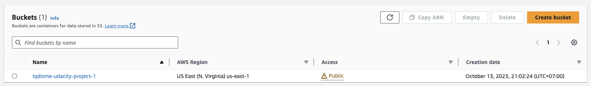
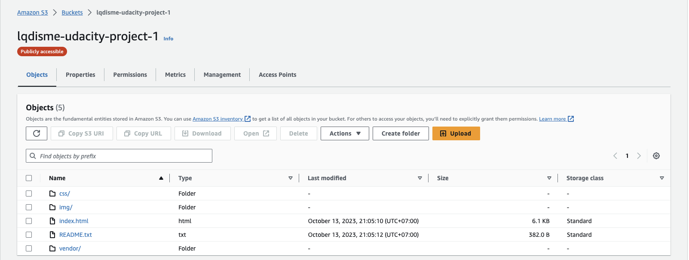
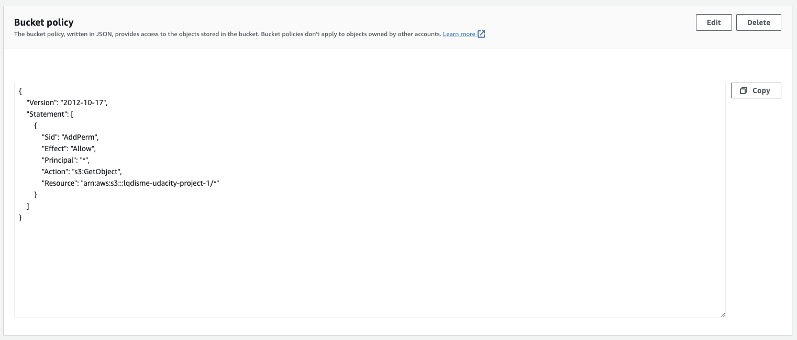
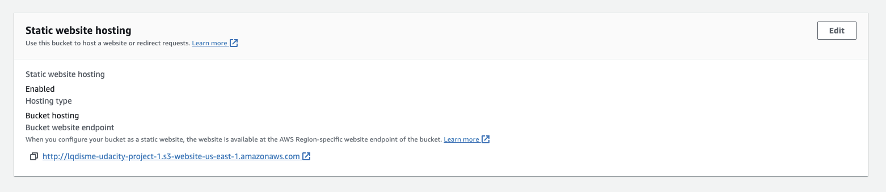
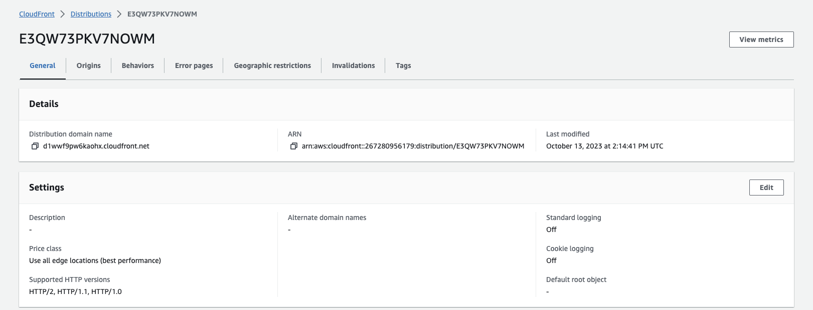

# Deploy Static Website on AWS

```
In this project, you will deploy a static website to AWS using S3, CloudFront, and IAM.

The files included are: 

index.html - The Index document for the website.
/img - The background image file for the website.
/vendor - Bootssrap CSS framework, Font, and JavaScript libraries needed for the website to function.
/css - CSS files for the website.
```

## Step 1. Create S3 Bucket


## Step 2. Upload files to S3 Bucket


## Step 3. Secure Bucket via IAM


## Step 4. Configure S3 Bucket


## Step 5. Distribute website via CloudFront


## Step 6. Access Website in Web Browser


### CloudFront domain
`https://d1wwf9pw6kaohx.cloudfront.net`

### Website endpoint
``http://lqdisme-udacity-project-1.s3-website-us-east-1.amazonaws.com`

### S3 object URL
`https://lqdisme-udacity-project-1.s3.amazonaws.com/index.html`