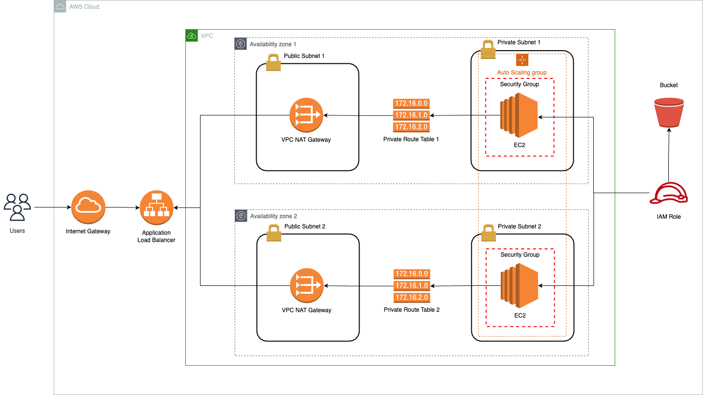

# CD12352 - Infrastructure as Code Project Solution

## Architecture


## Instructions
1. Execute network infrastructure stack. 
```bash
run-networks.sh create
```
2. Execute services infrastructure stack.
```bash
run-udagram.sh create
```

## Results

http://lqdism-webap-jir9mywnefgo-1082081678.us-east-1.elb.amazonaws.com/